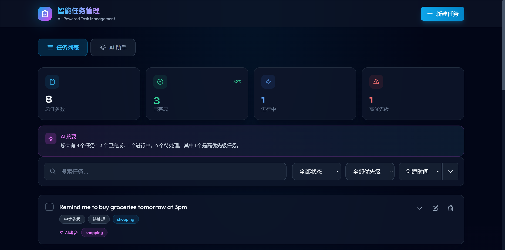
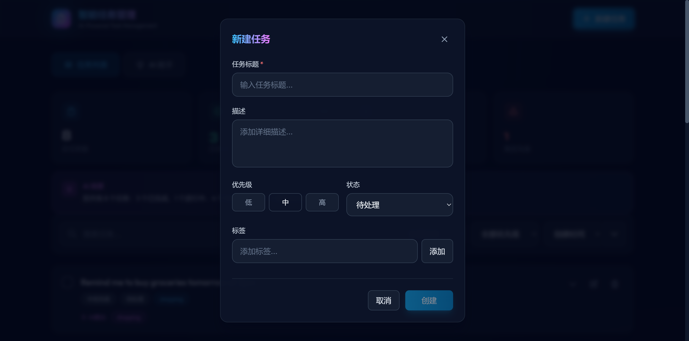
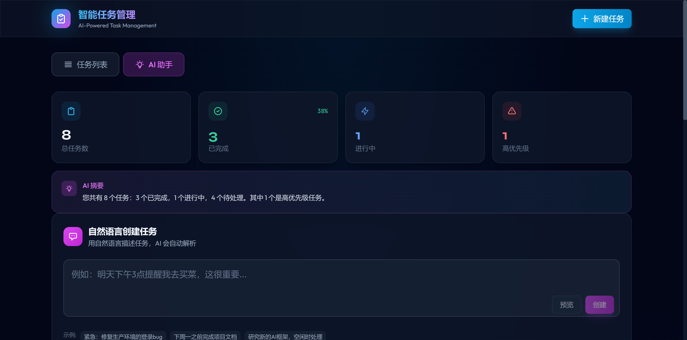
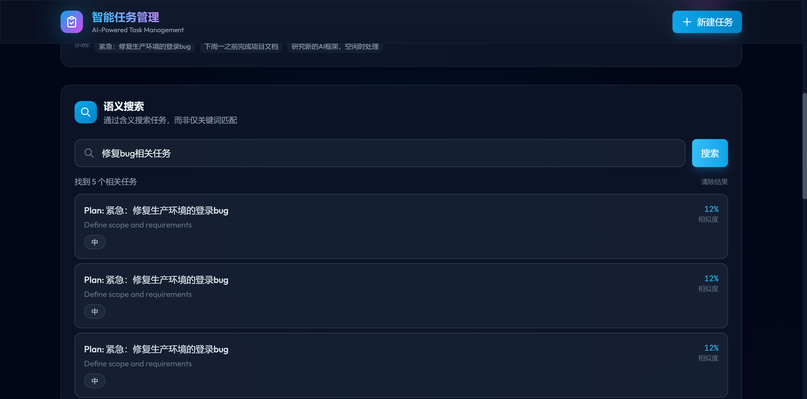

# 智能任务管理系统 (Intelligent Task Management System)

## Role Track
**AI/LLM 开发者赛道**

## Tech Stack
- **后端语言**: Python 3.10+
- **后端框架**: FastAPI
- **前端框架**: Vue 3 + TypeScript
- **样式**: Tailwind CSS
- **状态管理**: Pinia
- **数据库**: SQLite (异步 aiosqlite)
- **AI/LLM**: OpenAI API (支持兼容接口)
- **其他工具**: SQLAlchemy (ORM), Pydantic (数据验证)

## Documentation
- **DeepWiki 文档**: [Development Guide](https://deepwiki.com/Reviahh/Task-Management-System/6-development-guide) - 完整的开发指南，包含环境配置、测试流程和 API 参考
- **测试覆盖率报告**: [Test Coverage Report](docs/TEST_COVERAGE_REPORT.md) - 详细的测试覆盖率分析和测试结果

## Features Implemented

### Core Features (核心功能)
- [x] Task CRUD 操作 (创建、读取、更新、删除)
- [x] 任务属性: id, title, description, status, priority, created_at, updated_at, tags
- [x] 数据持久化 (SQLite)
- [x] 任务过滤 (按状态、优先级、标签)
- [x] 任务排序 (创建时间、更新时间、优先级、标题)
- [x] 分页支持
- [x] 关键词搜索

### AI/LLM Features (AI 功能)
- [x] **自然语言任务解析**: 从自然语言输入中提取任务标题、描述、优先级、标签、截止日期
- [x] **智能标签建议**: 基于任务内容自动推荐相关标签
- [x] **优先级推荐**: 分析任务内容智能推荐优先级
- [x] **任务分解**: 将复杂任务拆分为可执行的子任务
- [x] **语义搜索**: 基于语义相似度搜索任务，而非仅关键词匹配
- [x] **任务摘要**: AI 生成任务统计和洞察摘要 (支持每日/每周)
- [x] **智能任务分类**: 自动分析任务内容并归类到预设类别
- [x] **相似任务检测**: 查找相似的任务，避免重复
- [x] **任务洞察**: AI 分析任务数据，提供完成率、状态分布和优化建议

### Frontend Features (前端功能)
- [x] 现代化响应式 UI 设计
- [x] 任务列表视图
- [x] 任务创建/编辑表单
- [x] 过滤和排序控件
- [x] 实时搜索
- [x] AI 功能专属界面
- [x] 任务统计仪表板
- [x] 流畅的动画和过渡效果
- [x] 深色主题设计

## Screenshots (应用截图)

### 主界面 - 任务仪表板

*任务管理主界面，展示任务列表、统计信息和快捷操作*

### 任务列表视图

*支持筛选、排序和分页的任务列表*

### 任务创建/编辑

*任务创建和编辑表单，支持标题、描述、优先级和标签*

### AI 功能面板

*AI 驱动的智能功能：自然语言解析、标签建议、任务分解*

### 语义搜索

*基于语义相似度的智能搜索结果*

> **注意**: 截图文件存放在 `docs/screenshots/` 目录下

## Project Structure
```
project/
├── README.md
├── .gitignore
├── backend/
│   ├── requirements.txt
│   ├── app/
│   │   ├── __init__.py
│   │   ├── main.py              # FastAPI 应用入口
│   │   ├── config.py            # 配置管理
│   │   ├── database.py          # 数据库配置
│   │   ├── models/
│   │   │   ├── __init__.py
│   │   │   └── task.py          # Task 数据模型
│   │   ├── schemas/
│   │   │   ├── __init__.py
│   │   │   └── task.py          # Pydantic schemas
│   │   ├── routes/
│   │   │   ├── __init__.py
│   │   │   └── tasks.py         # API 路由
│   │   └── services/
│   │       ├── __init__.py
│   │       ├── task_service.py  # 任务业务逻辑
│   │       └── ai_service.py    # AI 功能服务
│   └── tasks.db                 # SQLite 数据库 (运行后生成)
└── frontend/
    ├── package.json
    ├── vite.config.ts
    ├── tailwind.config.js
    ├── index.html
    └── src/
        ├── main.ts
        ├── style.css
        ├── App.vue
        ├── types/
        │   └── task.ts          # TypeScript 类型定义
        ├── api/
        │   └── tasks.ts         # API 客户端
        ├── stores/
        │   └── tasks.ts         # Pinia store
        └── components/
            ├── TaskList.vue     # 任务列表组件
            ├── TaskForm.vue     # 任务表单组件
            ├── FilterBar.vue    # 过滤栏组件
            ├── AIFeatures.vue   # AI 功能组件
            └── TaskSummary.vue  # 任务摘要组件
```

## Setup Instructions

### Prerequisites (前置要求)
- Python 3.10+
- Node.js 18+
- npm 或 yarn
- OpenAI API Key (可选，用于 AI 功能)

### Backend Setup (后端设置)

1. 进入后端目录并创建虚拟环境:
```bash
cd backend
python -m venv venv

# Windows
venv\Scripts\activate

# Linux/Mac
source venv/bin/activate
```

2. 安装依赖:
```bash
pip install -r requirements.txt
```

3. 配置环境变量 (创建 `.env` 文件):
```bash
# OpenAI API Configuration (可选)
OPENAI_API_KEY=your_openai_api_key_here
OPENAI_BASE_URL=https://api.openai.com/v1

# Database Configuration
DATABASE_URL=sqlite+aiosqlite:///./tasks.db

# Application Settings
DEBUG=true
```

4. 启动后端服务:
```bash
uvicorn app.main:app --reload --port 8000
```

后端 API 文档: http://localhost:8000/docs

### Frontend Setup (前端设置)

1. 进入前端目录并安装依赖:
```bash
cd frontend
npm install
```

2. 启动开发服务器:
```bash
npm run dev
```

前端访问地址: http://localhost:3000

## API Documentation

### Task Endpoints (任务接口)

| Method | Endpoint | Description |
|--------|----------|-------------|
| POST | `/api/tasks/` | 创建新任务 |
| GET | `/api/tasks/` | 获取任务列表 (支持分页、过滤、排序) |
| GET | `/api/tasks/{id}` | 获取单个任务 |
| PUT | `/api/tasks/{id}` | 更新任务 |
| DELETE | `/api/tasks/{id}` | 删除任务 |

### AI Endpoints (AI 接口)

| Method | Endpoint | Description |
|--------|----------|-------------|
| POST | `/api/tasks/ai/parse` | 解析自然语言输入 |
| POST | `/api/tasks/ai/create-from-text` | 从自然语言创建任务 |
| POST | `/api/tasks/{id}/ai/suggest-tags` | 获取标签建议 |
| POST | `/api/tasks/{id}/ai/suggest-priority` | 获取优先级建议 |
| POST | `/api/tasks/{id}/ai/breakdown` | 任务分解 |
| POST | `/api/tasks/ai/semantic-search` | 语义搜索 |
| POST | `/api/tasks/ai/summary` | 获取任务摘要 (支持 daily/weekly 时间范围) |
| POST | `/api/tasks/ai/similar` | 查找相似任务 |
| POST | `/api/tasks/ai/categorize` | 智能任务分类 |
| GET | `/api/tasks/ai/insights` | 获取任务洞察和分析 |

### Request/Response Examples

#### 创建任务
```bash
POST /api/tasks/
Content-Type: application/json

{
  "title": "完成项目文档",
  "description": "编写 README 和 API 文档",
  "priority": "high",
  "tags": ["documentation", "project"]
}
```

#### 自然语言解析
```bash
POST /api/tasks/ai/parse
Content-Type: application/json

{
  "text": "明天下午3点提醒我去开会，这很重要"
}

Response:
{
  "title": "去开会",
  "description": null,
  "priority": "high",
  "tags": ["meeting"],
  "due_date": "2024-01-05 15:00",
  "confidence": 0.85
}
```

#### 语义搜索
```bash
POST /api/tasks/ai/semantic-search
Content-Type: application/json

{
  "query": "关于代码的任务",
  "limit": 10
}
```

## Design Decisions (设计决策)

### 1. 技术选型
- **FastAPI**: 选择 FastAPI 因为其高性能、自动 API 文档生成、原生异步支持
- **Vue 3 + TypeScript**: 提供更好的类型安全和开发体验
- **SQLite**: 简单部署，适合演示项目，易于切换到其他数据库
- **Tailwind CSS**: 快速构建现代化 UI，高度可定制

### 2. AI 功能实现
- **双重策略**: 同时支持 OpenAI API 和本地 fallback 方案
- **Fallback 机制**: 当 API 不可用时，使用基于规则的本地解析
- **嵌入存储**: 在数据库中存储文本嵌入向量，支持语义搜索
- **简化向量存储**: 使用 JSON 字段存储嵌入，避免额外的向量数据库依赖

### 3. 架构设计
- **服务层分离**: AI 服务和任务服务分离，便于维护和测试
- **异步优先**: 全异步设计，提高并发处理能力
- **类型安全**: 使用 Pydantic 进行数据验证，TypeScript 用于前端类型安全

## Challenges & Solutions (挑战与解决方案)

### 1. AI API 可用性
**挑战**: 用户可能没有 OpenAI API Key
**解决**: 实现完整的 fallback 机制，基于关键词和规则的本地解析

### 2. 语义搜索性能
**挑战**: 大量任务时语义搜索可能较慢
**解决**: 预计算并存储嵌入向量，搜索时只计算查询的嵌入

### 3. 前后端类型同步
**挑战**: 保持前后端数据类型一致
**解决**: 使用 TypeScript 接口镜像 Pydantic schemas

## Bonus Features (附加功能)

### Testing (测试)

本项目采用 **pytest** + **pytest-asyncio** 测试框架，实现了完整的单元测试和集成测试覆盖。

#### 测试框架与工具

| 工具 | 版本 | 用途 |
|------|------|------|
| pytest | 8.0.0 | 测试框架 |
| pytest-asyncio | 0.23.3 | 异步测试支持 |
| pytest-cov | 4.1.0 | 代码覆盖率 |
| pytest-html | 4.1.1 | HTML 测试报告 |
| httpx | 0.26.0 | 异步 HTTP 测试客户端 |

---

### Unit Tests (单元测试)

> **定义**: 单元测试针对单个函数、方法或类进行隔离测试，验证其独立的逻辑正确性。

测试文件位于 `backend/tests/` 目录。

#### `test_tasks.py` - 任务服务单元测试

| 测试类 | 测试用例 | 测试目标 | 类型 |
|--------|----------|----------|------|
| **TestTaskCRUD** | `test_create_task` | 验证任务创建逻辑，检查字段正确填充 | Unit |
| | `test_create_task_minimal` | 验证默认值填充逻辑 | Unit |
| | `test_create_task_invalid` | 验证输入校验逻辑（Pydantic 验证） | Unit |
| | `test_get_task_not_found` | 验证 404 错误处理逻辑 | Unit |
| | `test_update_task` | 验证更新逻辑，字段部分更新 | Unit |
| | `test_delete_task_not_found` | 验证删除不存在资源的错误处理 | Unit |
| **TestTaskFiltering** | `test_filter_by_status` | 验证状态过滤逻辑 | Unit |
| | `test_filter_by_priority` | 验证优先级过滤逻辑 | Unit |
| | `test_search_tasks` | 验证搜索逻辑 | Unit |
| | `test_pagination` | 验证分页计算逻辑 | Unit |

#### `test_ai_features.py` - AI 服务单元测试

| 测试类 | 测试用例 | 测试目标 | 类型 |
|--------|----------|----------|------|
| **TestNaturalLanguageParsing** | `test_parse_simple_task` | 验证 NLP 解析函数输出格式 | Unit |
| | `test_parse_urgent_task` | 验证优先级关键词识别逻辑 | Unit |
| | `test_parse_empty_text` | 验证空输入校验逻辑 | Unit |
| **TestTagSuggestions** | `test_suggest_tags` | 验证标签建议算法输出 | Unit |
| | `test_suggest_tags_not_found` | 验证资源不存在时的错误处理 | Unit |
| **TestPrioritySuggestions** | `test_suggest_priority` | 验证优先级推荐算法 | Unit |
| **TestTaskBreakdown** | `test_breakdown_task` | 验证任务分解算法输出格式 | Unit |
| **TestTaskCategorization** | `test_categorize_task` | 验证分类算法输出 | Unit |
| | `test_categorize_work_task` | 验证工作类任务分类准确性 | Unit |

---

### Integration Tests (集成测试)

> **定义**: 集成测试验证多个组件协同工作的完整流程，测试组件之间的交互是否正确。

#### `test_tasks.py` - API 集成测试

| 测试类 | 测试用例 | 测试流程 | 涉及组件 |
|--------|----------|----------|----------|
| **TestTaskCRUD** | `test_get_tasks_empty` | HTTP Request → Router → Service → DB → Response | API + DB |
| | `test_get_tasks` | 完整查询流程：请求 → 数据库查询 → 响应序列化 | API + Service + DB |
| | `test_get_task_by_id` | 单资源查询：路由解析 → 数据库查找 → JSON 响应 | API + Service + DB |
| | `test_delete_task` | 删除流程：认证 → 删除操作 → 验证删除结果 | API + Service + DB |
| **TestHealthCheck** | `test_health_check` | 健康检查：API → 数据库连接测试 → AI 服务状态 | API + DB + AI Service |
| | `test_root_endpoint` | 根端点响应验证 | API |

#### `test_ai_features.py` - AI 服务集成测试

| 测试类 | 测试用例 | 测试流程 | 涉及组件 |
|--------|----------|----------|----------|
| **TestNaturalLanguageParsing** | `test_create_from_natural_language` | NLP 解析 → 任务创建 → 数据库存储 | API + AI Service + DB |
| **TestSemanticSearch** | `test_semantic_search` | 查询向量化 → 相似度计算 → 结果排序 | API + AI Service + DB |
| | `test_semantic_search_empty_query` | 空查询校验 → 错误响应 | API + Validation |
| **TestTaskSummary** | `test_get_summary` | 数据聚合 → AI 摘要生成 → 响应 | API + AI Service + DB |
| | `test_get_daily_summary` | 时间过滤 → 聚合 → 摘要 | API + AI Service + DB |
| **TestTaskInsights** | `test_get_insights` | 数据分析 → 洞察生成 → 建议输出 | API + AI Service + DB |
| **TestSimilarTasks** | `test_find_similar_tasks` | 向量检索 → 相似度排序 → 结果返回 | API + AI Service + DB |

---

#### 测试配置文件

**`pytest.ini`**:
```ini
[pytest]
asyncio_mode = auto
testpaths = tests
python_files = test_*.py
python_functions = test_*
python_classes = Test*
addopts = -v --tb=short --strict-markers --html=reports/test_report.html --self-contained-html --cov=app --cov-report=html:reports/coverage --cov-report=term-missing
```

**`conftest.py`** 提供的 Fixtures:
| Fixture | 作用域 | 描述 |
|---------|--------|------|
| `event_loop` | session | 创建异步事件循环 |
| `test_db` | function | 创建测试数据库并自动清理 |
| `client` | function | 异步 HTTP 测试客户端 |
| `sample_task` | function | 预创建的示例任务 |

#### 运行测试

```bash
# 进入后端目录
cd backend

# 运行所有测试
pytest

# 运行单元测试
pytest tests/test_tasks.py::TestTaskCRUD::test_create_task -v
pytest tests/test_tasks.py::TestTaskFiltering -v

# 运行集成测试
pytest tests/test_tasks.py::TestHealthCheck -v
pytest tests/test_ai_features.py::TestSemanticSearch -v

# 生成覆盖率报告
pytest --cov=app --cov-report=html:reports/coverage
```

#### 测试报告

| 报告类型 | 路径 | 描述 |
|----------|------|------|
| HTML 测试报告 | `backend/reports/test_report.html` | 可视化测试结果 |
| 覆盖率报告 | `backend/reports/coverage/index.html` | 代码覆盖率详情 |

#### 测试统计

| 指标 | 数值 |
|------|------|
| 总测试用例数 | **32** |
| Unit Tests (单元测试) | 20 |
| Integration Tests (集成测试) | 12 |
| 测试文件数 | 2 |
| 测试类数 | 14 |

### Logging (日志)
- [x] **结构化日志**: JSON 格式日志输出
- [x] **请求日志中间件**: 记录所有 HTTP 请求和响应
- [x] **上下文日志**: 支持请求 ID 跟踪

### Monitoring (监控)
- [x] **健康检查端点**: `/health` 完整健康检查
- [x] **存活探针**: `/health/live` Kubernetes 存活检查
- [x] **就绪探针**: `/health/ready` Kubernetes 就绪检查
- [x] **数据库连接检查**: 自动检测数据库状态

### Security (安全)
- [x] **安全头部**: X-Content-Type-Options, X-Frame-Options, X-XSS-Protection
- [x] **CORS 配置**: 可配置的跨域资源共享
- [x] **SQL 注入防护**: 使用 SQLAlchemy ORM 参数化查询
- [x] **输入验证**: Pydantic 数据验证
- [x] **请求 ID**: 每个请求自动生成唯一 ID

### Accessibility (无障碍)
- [x] **ARIA 标签**: 完整的 ARIA 角色和标签
- [x] **键盘导航**: 支持键盘操作
- [x] **跳过链接**: 允许跳过导航到主内容
- [x] **屏幕阅读器支持**: sr-only 类和 aria-live 区域
- [x] **高对比度模式**: 支持 prefers-contrast 媒体查询
- [x] **减少动画**: 支持 prefers-reduced-motion

## Future Improvements (未来改进)

- [ ] 用户认证和授权系统
- [ ] 任务依赖关系管理
- [ ] 实时协作 (WebSocket)
- [ ] 向量数据库集成 (ChromaDB/FAISS) 提升搜索性能
- [ ] 任务模板功能
- [ ] 导出功能 (JSON/CSV/PDF)
- [ ] 多语言支持
- [ ] 移动端适配优化
- [ ] Docker 容器化部署
- [ ] 性能测试和优化文档

## Known Limitations (已知限制)

1. **语义搜索**: 当前使用简化的向量相似度计算，大规模数据时性能可能下降
2. **AI 功能**: 依赖外部 API，网络不稳定时可能影响体验
3. **数据库**: SQLite 适合小规模使用，生产环境建议切换到 PostgreSQL
4. **无实时更新**: 当前未实现 WebSocket，多用户场景需要手动刷新

## Time Spent
3 小时

## AI Assistant Usage
本项目使用 AI 辅助开发，主要用于:
- 代码结构设计建议
- 代码生成和优化
- 文档编写

最终代码经过人工审核和调整。
